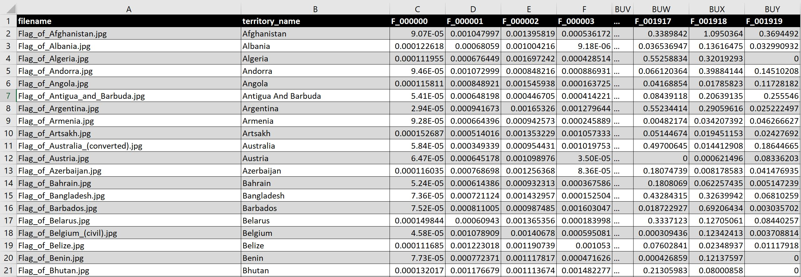

# Flag Similarity Search


Each of the 200+ flags available in Wikipedia's [gallery of sovereign state flags](https://en.wikipedia.org/wiki/Gallery_of_sovereign_state_flags) 
have been featurised using pre-trained models such as **`DenseNet201`**, **`InceptionV3`**, 
**`ResNet152V2`**, **`VGG16`**, and **`Xception`**. The featurisation process allows us to represent 
each flag as an n-dimensional vector and perform cosine similarity searches to find most 
similar flags given a query flag.


## Data Gathering

I used the [Wikipedia's Python API](https://pypi.org/project/Wikipedia-API/) to download the flags from 
[Gallery of Sovereign State Flags](https://en.wikipedia.org/wiki/Gallery_of_sovereign_state_flags) which are in 
SVG-format - see below how to convert SVGs into PNGs (you really need to convert them into PNG first!)
 
#### Converting SVG files to PNG/JPEG
It is a huge pain in the back to convert SVGs into png/jpg on Windows machine. Much easier in Linux!


##### Node.js app to the rescue.
1. Install [node.js](https://nodejs.org/en/download/) 
2. Install [convert-svg-to-png](https://www.npmjs.com/package/convert-svg-to-png) with `--global` option
3. [Optional - you really should be using svg-to-png mentioned above] Install [convert-svg-to-jpeg](https://www.npmjs.com/package/convert-svg-to-jpeg) with `--global` option
4. You can then convert all the svg flags downloaded to `DataDownloader\flags` with the following command:

    ```convert-svg-to-png DataDownloader\flags\svg\*.svg --height 1400 --width 2100```
    
    **or**
    
    ```convert-svg-to-jpeg DataDownloader\flags\svg\*.svg --height 1400 --width 2100```
5. Note regarding the height & width used - some of the svg files have height/width information missing so if you run 
without the height & width specified the `convert-svg-to-jpeg` will throw errors. 
The reason I'm using such large size for the convert jpg's is because some of the flags are quite large and varied in their 
aspect ratio: a full hd dimensions of 1920(w)x1080(h) seems to work best but clips the wings of the bird on Zambia's flag.
a 2100x1400 seems to give the full view of the flags of all countries.
 
     If use smaller sizes such as 256x256
 then flags such as Algeria get truncated down to a a green square. 
 
6. Another issue with using fixed size output for jpegs is rest of the area covering the flag will be white - which means we would have to crop out the white areas - which causes issues with flags such as one of Algeria which has a large white portion on the right which could pose issues in cropping to the flag.
7. This is where a PNG file is much better since the area outside of the flag is transparent instead of white - much easier to crop to content.


### Running Order
First run ``DataDownloader\download_flags.py`` - this will download the flags in SVG format and place them in 
``DataDownloader\flags\svg`` folder. 

Second, run ```convert-svg-to-png DataDownloader\flags\svg\*.svg --height 1400 --width 2100``` this will place PNG 
version of the SVG flags (in the same folder as the SVG files)

Then finally run ``DataDownloader\crop_flags.py`` - this will take the PNG images and crops them to content and places 
them in  ``DataDownloader\flags\cropped_jpgs`` folder - these are the images which will be featurised.

## Feature Extraction
There are some useful helper functions defined in ``utils\dl_utils.py`` that are used in 
``FeatureExtraction\featuriser.py``. Each of the flags is passed through the following ImageNet pre-trained models to 
convert them into an n-dimensional vector:
1. **`DenseNet201`**
2. **`InceptionV3`** 
3. **`ResNet152V2`**
4. **`VGG16`** 
5. **`Xception`**

The extracted features are stored in ``csv`` format in ``FeatureExtraction\data`` folder

Here's a sample of one of those files - as you can see the first_column is the filename_name and second column is the 
cleansed version of the filename and columns `F_000000` to `F_001919` represent the 1920-dimensional vectors:


**If you have a better representation for the flags then you can create a new csv file in the above format and place it
in the ``FeatureExtraction\data`` folder - later you can visualise the new representation using the Dash app built in this repo 
(see below regarding the app)**

## Visualisation
For Visualisation I used [Dash](https://dash.plotly.com/) from [Plotly](https://plotly.com/). As you can see from the 
gif above - you select the territory you are interested in, the selected territory name is passed to a function in the 
background which returns a dictionary of search results - one per model
(printed to console). 
Then we use PIL to create an image grid - see ``get_image_grid`` function in ``Visualisation\utils.py`` that dynamically
 builds a static image grid from the returned results. I used static image to present the results in a grid as I had a
 hard time trying to get the dash components to display the flag images in a rigid grid 
 (\** shakes angry fist at responsive design \**)

```json
{'DenseNet201': [['Flag_of_Finland.jpg', 'Finland', 4.440892098500626e-16],
                 ['Flag_of_Sweden.jpg', 'Sweden', 0.16088868168515547],
                 ['Flag_of_Denmark.jpg', 'Denmark', 0.1665205685942195],
                 ['Flag_of_Norway.jpg', 'Norway', 0.1752504636664094],
                 ['Flag_of_Chile.jpg', 'Chile', 0.19018336355717702],
                 ['Flag_of_Ukraine.jpg', 'Ukraine', 0.20090111639193275],
                 ['Flag_of_Poland.jpg', 'Poland', 0.201604416654091],
                 ['Flag_of_the_United_Arab_Emirates.jpg',
                  'United Arab Emirates',
                  0.21213499290608784],
                 ['Flag_of_Estonia.jpg', 'Estonia', 0.21763121653622253],
                 ['Flag_of_Russia.jpg', 'Russia', 0.21828527325740466]],
 'InceptionV3': [['Flag_of_Finland.jpg', 'Finland', 0.0],
                 ['Flag_of_Norway.jpg', 'Norway', 0.18458801511146317],
                 ['Flag_of_Iceland.jpg', 'Iceland', 0.20861563293731045],
                 ['Flag_of_Sweden.jpg', 'Sweden', 0.24642986981596893],
                 ['Flag_of_the_Central_African_Republic.jpg',
                  'Central African Republic',
                  0.2539065443658842],
                 ['Flag_of_the_United_Kingdom.jpg',
                  'United Kingdom',
                  0.26154659927124446],
                 ['Flag_of_Greece.jpg', 'Greece', 0.2834753500266184],
                 ['Flag_of_Tuvalu.jpg', 'Tuvalu', 0.28634856801208275],
                 ['Flag_of_Nauru.jpg', 'Nauru', 0.294767818063558],
                 ['Flag_of_Oman.jpg', 'Oman', 0.3052322375119747]],
 'ResNet152V2': [['Flag_of_Finland.jpg', 'Finland', 0.0],
                 ['Flag_of_Denmark.jpg', 'Denmark', 0.1406234062709627],
                 ['Flag_of_Norway.jpg', 'Norway', 0.2282200053026595],
                 ['Flag_of_Greece.jpg', 'Greece', 0.2518786942016714],
                 ['Flag_of_Lebanon.jpg', 'Lebanon', 0.26569652789575904],
                 ['Flag_of_Oman.jpg', 'Oman', 0.27296637864071094],
                 ['Flag_of_Thailand.jpg', 'Thailand', 0.2748993052425259],
                 ['Flag_of_Chile.jpg', 'Chile', 0.2759584440402424],
                 ['Flag_of_Iceland.jpg', 'Iceland', 0.27633922411874634],
                 ['Flag_of_Sierra_Leone.jpg',
                  'Sierra Leone',
                  0.27656149112953665]],
 'VGG16': [['Flag_of_Finland.jpg', 'Finland', 3.3306690738754696e-16],
           ['Flag_of_the_Dominican_Republic.jpg',
            'Dominican Republic',
            0.061376965651601334],
           ['Flag_of_the_Central_African_Republic.jpg',
            'Central African Republic',
            0.06808287815626479],
           ['Flag_of_Italy.jpg', 'Italy', 0.08319521065761581],
           ['Flag_of_Greece.jpg', 'Greece', 0.08328531084753366],
           ['Flag_of_Denmark.jpg', 'Denmark', 0.084009715903678],
           ['Flag_of_France.jpg', 'France', 0.08454281644877004],
           ['Flag_of_Ireland.jpg', 'Ireland', 0.0870953505651968],
           ['Flag_of_Nigeria.jpg', 'Nigeria', 0.08899896004235741],
           ["Flag_of_Côte_d'Ivoire.jpg", "Côte D'Ivoire", 0.09112119911039218]],
 'Xception': [['Flag_of_Finland.jpg', 'Finland', 0.0],
              ['Flag_of_Norway.jpg', 'Norway', 0.1522670382050063],
              ['Flag_of_Sweden.jpg', 'Sweden', 0.15604537858512368],
              ['Flag_of_Iceland.jpg', 'Iceland', 0.15968075077528188],
              ['Flag_of_Denmark.jpg', 'Denmark', 0.17089308850412854],
              ['Flag_of_the_Central_African_Republic.jpg',
               'Central African Republic',
               0.19962177251836966],
              ['Flag_of_Greece.jpg', 'Greece', 0.20907359789402202],
              ['Flag_of_Oman.jpg', 'Oman', 0.24938050799795053],
              ['Flag_of_the_United_Kingdom.jpg',
               'United Kingdom',
               0.2734672936873942],
              ['Flag_of_the_Republic_of_Abkhazia.jpg',
               'Republic Of Abkhazia',
               0.2757425162431465]]}
```

# Installation
Use your favourite virtual environment manager to set up your environment first and then do the following:

```shell script
git clone https://github.com/SashiDareddy/FlagSimilarity.git
cd FlagSimilarity
pip install -r requirements.txt
```

To run the app...
```shell script
cd Visualisation
python app_static_image.py
```